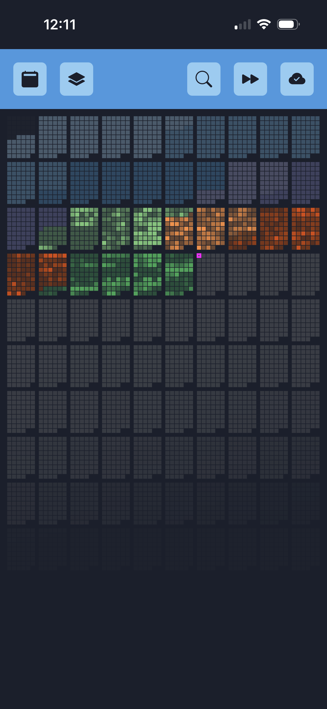

# Life calendar

This is a Progressive Web App built to visualise health/habit data and display personal journal entries.

This project was originally based on [an old blog post](https://waitbutwhy.com/2014/05/life-weeks.html) about visualising the amount of time you have left in your life. It has since evolved into an app I use daily.

This screenshot shows the number of git commits I've made (in public GitHub repos) in my lifetime.

## Architecture

### Server

- Lightweight Express server (runs on my laptop on a static local IP address)
- `/sync` endpoint to return all files modified since a given timestamp
- Includes simple auth system

### PWA

- Uses Service Workers (with Workbox) for a fully offline app
- Uses Chakra UI for a responsive mobile and desktop layout
- Uses IndexedDB (with idb) to cache and search data locally (including images)
- Uses Jotai for state management and React Suspense to help manage async IndexedDB calls

### Calendar

- Manually rendered on canvas for performance
- Responds to viewport size to align squares perfectly on pixel boundaries
- Displays "layers" of health/habit data (see [this repo](https://github.com/davidxmoody/self-tracking) for scripts that generate the layers)
- Later weeks fade out relative to the chance of living to that age
- Searching for text generates a temporary layer highlighting matches
